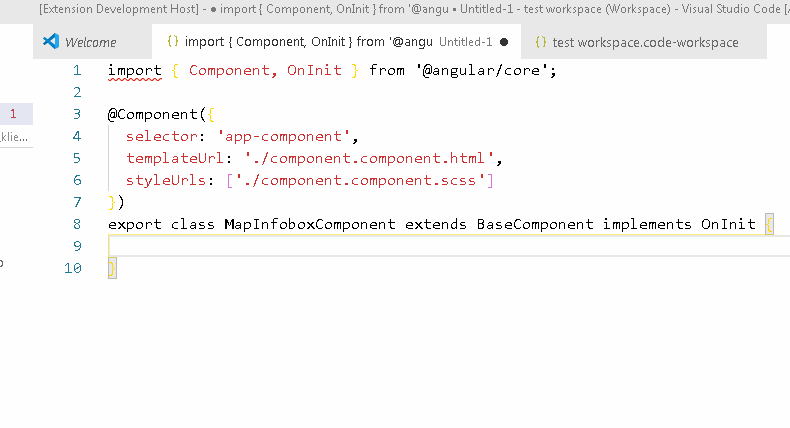

# Assistant README

Boost your development by providing custom tips displayed in the code.

1. Open Visual Studio Code Workspace
2. If you don't have it, choose file "Save Workspace As..."
3. Press CTRL + ALT + P to open options
4. Find "Preferences: Open Workspace Settings (JSON) and open it
5. In the section settings add a item "assistant" and under it an item "rules" and under it an array of rules.

Each rule should contain:
regex - a string with a regex rule
message - text that should be displayed when the rule is trigerred

Example workspace configuration:

```

{
	.....
	"settings": {
		"assistant": {
			"rules": [
				{
					"regex": "tom",
					"message": "hello"
				}
			]
    }
	},
  .....
}
```

When saved, typing 'tom" in a source code file will display "hello" text above. You can use RegEx to write more advanced rules.

## Demo

Regex: @Input\\(\\) .*: false;. Prevents from bad boolean Input declaration in Angular component



## Installation

1. Go to Visual Studio Code
2. Go to Extensions from left side bar
3. Find "Assistant" by Tomasz Smykowski
4. Install it
5. Copy above rule and test if it works
6. Boost your development speed and quality

Extension in the Visual Studio Code Marketplace:

https://marketplace.visualstudio.com/items?itemName=tomasz-smykowski.assistant

## Autor

Tomasz Smykowski (http://tomasz-smykowski.com)