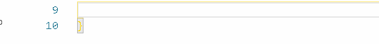

## Demo

Assistant is language and framework agnostic. Here is an example workspace configuration for Angular/TypeScript. It informs about a bad boolean Input declaration in Angular component. Normally it does not trigger build or linter errors and is a hard to track problem:

```
{
 ...
 "settings": {
  "assistant": {
   "rules": [
    {
     "regex": "@Input\\\\(\\\\) .*: false;",
     "message": "Define property value with =, not with:"
    }
   ]
  }
 },
 ...
}
```

Result:



# Assistant - Realtime Linter & Quality Assurance For Your Team

Are you annoyed that your notes on hard to fix issues are not available when you need them the most - while coding? Is setting standards for the team code broken even if you have a centralized place for rules because it i hard to keep tabs on them all the time? 

Never make the same mistakes again!

At last there is a solution to these problems. Let me present you a groundbreaking Visual Studio Code extension. Assistant will boost your team code quality and performance.

No more looking into documentation. Now you don't need to search through piles of notes to find what you need. Now you can write notes that will pop-up exactly when you or your team member writes a code that they apply to. 

The extension is designed to make the process super easy:

1) Write notes and define RegEx rules when they should show up
2) Use your favourite version control software to share rules
3) Rules will automatically show up for all team member when they need them

## Patrons

Now you can become a patron of Assistant and be listed here. Read below

## Become a patron

Become a patron for 3$ and receive amazing Patreon benefits:

https://www.patreon.com/tomaszs

## Installation

1. Go to Visual Studio Code
2. Go to Extensions from left side bar
3. Find "Assistant" by Tomasz Smykowski
4. Install it
5. Copy above rule and test if it works
6. Boost your development speed and quality

Extension in the Visual Studio Code Marketplace:

https://marketplace.visualstudio.com/items?itemName=tomasz-smykowski.assistant

## How to install ready-made rulesets?

Assistant is language and framework agnostic. The database of ready-made rulesets will grow over time. 

Available ready-made rulesets (in rulesets folder in the repo):

- angular.txt
- js.txt
- css.txt
- general.txt

Combine suitable rulesets for you stack.

If you have a set of rules for any language / library create MR, or send it in any way, to be included here!

## How to add your own Assistant rules?

You can add rules to workspace settings file, and/or to user settings file depending on your needs.


1a. If you want to add settings to workspace, open Visual Studio Code Workspace:

a) If you don't have it, choose file "Save Workspace As..."
b) Press CTRL + ALT + P to open options
c) Find/write "Preferences: Open Workspace Settings (JSON) and open it


1b. If you want to add settings to user settings, open Visual Studio Code User settings:

b) Press CTRL + ALT + P to open options
c) Find/write "Preferences: Open Settings (JSON) and open it


2. In the section settings add a item "assistant" and under it an item "rules" and under it an array of rules.

Each rule should contain:

regex - a string with a RegEx rule
message - text that should be displayed when the rule is trigerred

## How to add RegEx modifiers?

On default RegEx rules are processed with a 'g' modifier. You can change this behaviour. For example by adding an 'i' modifier to make the rule case insensitive. All RegEx modifiers are supported by the extension. How to add modifier?

1) Add a property "modifiers" to a rule and put there local modifier letters. For example: 'gi'.
2) Add a property "modifiers" on top of assistant JSON settings to set global modifiers for your rules

If both modifiers are set, local modifiers will be used.

## How to add multiline rule?

Set modifiers to "s"

## Licence

You can:

- install extension,
- use the extension,
- use rules

for free for whatever you want, including commercial use

## FAQ

### How to inspire to write my own rules?

Please read an articles of rules authors. They covers ideas for rules and concept of how to write them: 

Angular, CSS, JS:
https://medium.com/@tomaszs2/8-visual-studio-code-assistant-rules-for-nasty-angular-bugs-9f186277e0ab

SQL (by Chris Young):
https://dev.to/ronsoak/doing-the-impossible-using-assistant-to-make-a-sql-linter-and-how-you-can-make-it-lint-whatever-you-want-2ke2

### What is the difference between Assistant and SonarLint?

1. You don't need to connect to a server to use Assistant making setup as easy as installing the extension
2. Writing rules is extremely easy with Assistant, so everyone can do it right away
3. Messages show up right above the code you write in miliseconds. You can immediately fix your code

### What is the difference between Assistant and regular Linters

1. Assistant is realtime. You don't need to wait for the linting process to finish. Assistant makes the coding process a much smoother experience
2. Messages show up above the code you write when you write it. You don't need to look into "Problems tab" and navigate back to the place where situation occurred. So you don't loose an eye off the code you write
3. Writing Assistant rules is extremely easy. Everyone can do it right away

## Authors

Tomasz Smykowski (http://tomasz-smykowski.com)

## Patrons

Now you can become a patron of Assistant and be listed here. Read below

## Become a patron

Become a patron for 3$ and receive amazing patron benefits:

https://www.patreon.com/tomaszs